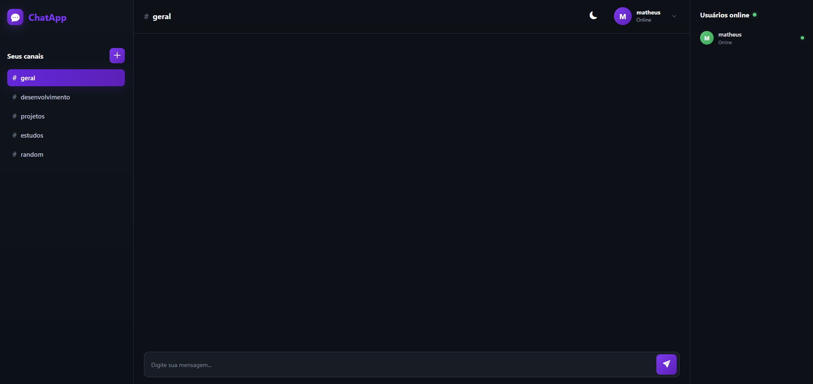
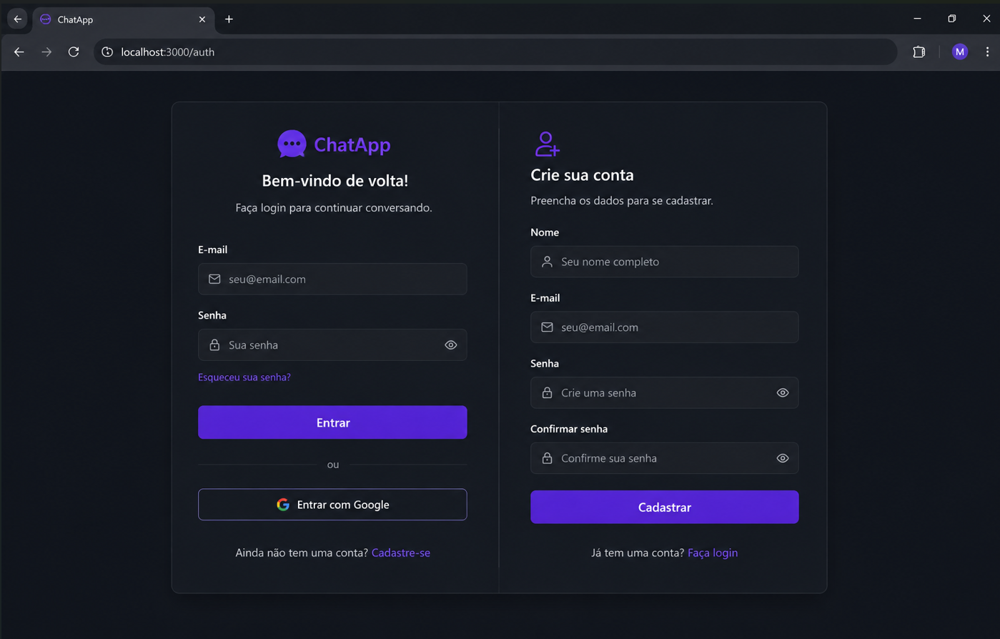

# 💬 ChatApp

<p align="center">
  <strong>Chat em tempo real desenvolvido com Node.js, Socket.IO e MongoDB.</strong>
</p>

<p align="center">
  Uma aplicação de comunicação com autenticação de usuários, canais, usuários online e recuperação de senha por e-mail.
</p>

---

## 📸 Preview

<p align="center">
  
  
</p>

---

## 📖 Sobre o projeto

O **ChatApp** é uma aplicação de chat em tempo real desenvolvida com foco em comunicação entre usuários através de diferentes canais.

O projeto utiliza **Socket.IO** para permitir a troca instantânea de mensagens e atualização dos usuários conectados, enquanto o **MongoDB** é utilizado para armazenar os dados dos usuários.

A aplicação também possui sistema de cadastro e login, gerenciamento de canais e recuperação de senha através de e-mail.

O projeto foi desenvolvido como forma de praticar e demonstrar conhecimentos em desenvolvimento **Full Stack**, comunicação em tempo real, APIs REST, autenticação e banco de dados.

---

## ✨ Funcionalidades

### 🔐 Autenticação

- Cadastro de usuários
- Login com e-mail e senha
- Senhas armazenadas utilizando hash com `bcryptjs`
- Logout
- Validação dos dados enviados
- Recuperação de senha
- Redefinição de senha através de link enviado por e-mail

### 💬 Chat em tempo real

- Envio de mensagens instantâneas
- Comunicação utilizando Socket.IO
- Atualização automática das mensagens
- Identificação do usuário que enviou cada mensagem
- Separação das conversas por canais

### #️⃣ Canais

- Visualização dos canais disponíveis
- Criação de novos canais
- Troca entre canais
- Exclusão de canais
- Canal padrão `geral`

### 👥 Usuários online

- Identificação dos usuários conectados
- Atualização automática da lista de usuários online
- Entrada e saída de usuários em tempo real

### 🎨 Interface

- Interface moderna em tema escuro
- Design inspirado em aplicações modernas de comunicação
- Layout dividido entre canais, chat e usuários online
- Ícones utilizando Bootstrap Icons
- Layout responsivo

---

## 🛠️ Tecnologias utilizadas

### Front-end

- HTML5
- CSS3
- JavaScript
- Bootstrap
- Bootstrap Icons

### Back-end

- Node.js
- Express.js
- Socket.IO

### Banco de dados

- MongoDB
- Mongoose

### Segurança

- bcryptjs
- Validação de dados
- Tokens para recuperação de senha
- Variáveis de ambiente com dotenv

### E-mail

- Nodemailer
- SMTP do Gmail

---

## 🧠 Conceitos utilizados

Durante o desenvolvimento foram utilizados diversos conceitos importantes de desenvolvimento web:

- APIs REST
- Comunicação em tempo real
- WebSockets
- Eventos com Socket.IO
- CRUD
- Autenticação
- Hash de senhas
- Tokens de recuperação
- Variáveis de ambiente
- Integração com banco de dados
- Manipulação do DOM
- LocalStorage
- Requisições HTTP com Fetch API
- Programação assíncrona com `async/await`

---

## 📁 Estrutura do projeto

```text
ChatApp/
│
├── public/
│   │
│   ├── chat.html
│   ├── chat.js
│   │
│   ├── index.html
│   ├── login.js
│   ├── loginsCss.css
│   │
│   ├── register.html
│   ├── register.js
│   ├── registerCss.css
│   │
│   ├── forgot-password.html
│   ├── reset-password.html
│   │
│   ├── style.css
│   ├── User.js
│   └── validate.js
│
├── .env
├── .gitignore
├── index.js
├── package.json
├── package-lock.json
└── README.md
